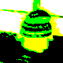
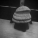
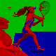
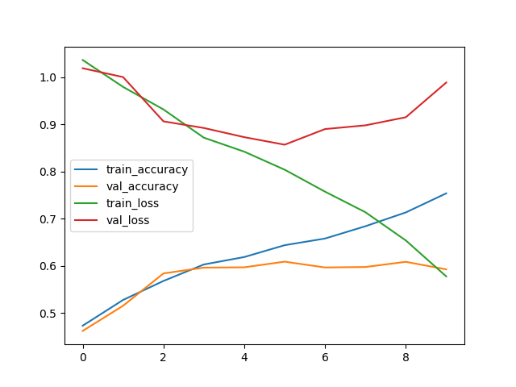

# Kaggle Images Classification Documentation

**Eduard-Valentin Dumitrescul (232)**

**May-June 2024**


## First Model (29th of May)

Loaded all the images with the corresponding labels. 
Multinomila Naive Bayes model: 0.418 accuracy in 12 seconds

Standardized  images: 0.418 accuracy in 4 seconds

> SVM: 0.39 with 100 iter

> SVM: 0.539 accuracy pooled 4*4 pixel areas together, max iterations
```
%%time
from sklearn import svm
from sklearn.preprocessing import MinMaxScaler
import numpy as np
import skimage.measure

reduced_training_images = (skimage.measure.block_reduce(training_images, (1,4,4,1), np.max)).reshape((10500, 10*40*3))
print(np.shape(reduced_training_images))
reduced_validation_images = (skimage.measure.block_reduce(validation_images, (1,4,4, 1), np.max)).reshape((3000, 10*40*3))

clf = svm.SVC(decision_function_shape='ovr', verbose=True, max_iter=-1, kernel="rbf")
clf.fit(reduced_training_images, training_labels)
score = clf.score(reduced_validation_images, validation_labels)

print("score on test: " + str(score))
```

> score on test: 0.5396666666666666
CPU times: user 1min 7s, sys: 628 ms, total: 1min 8s
Wall time: 1min 8s

## Image Preprocessing (30th of May)
- standardized (approximate preview)


- grayscale 


- mono (keep only the strongest pixel (eg. [23, 140, 24] -> [0, 140, 0]))



> SVM, mono images, 4x4 max pooling -> 0.498 accuracy

> SVM, grayscale, 2x2 max pooing -> 0.505 accuracy
```
clf = svm.SVC(decision_function_shape='ovr', verbose=True, max_iter=-1, kernel="rbf", C=1)
```


### CNN 1.0 (0.59 accuracy)
The first try using a Convolutional Neural Network:

```
import tensorflow as tf
from tensorflow.keras.utils import to_categorical
from tensorflow.keras.models import Sequential
from tensorflow.keras.layers import Conv2D, MaxPooling2D, AveragePooling2D, Flatten, Dense, Dropout
from tensorflow.keras.preprocessing.image import ImageDataGenerator
import numpy as np

model_train_images = standard_training_images
model_train_labels = to_categorical(training_labels, num_classes=3)
model_validation_images = standard_validation_images
model_validation_labels = to_categorical(validation_labels, num_classes=3)

trainining_datagen = ImageDataGenerator(
)
trainining_datagen.fit(model_train_images)


my_model = Sequential([
    Conv2D(16, (3, 3), activation='relu', input_shape=(80, 80, 3)),
    MaxPooling2D(2, 2),
    Conv2D(32, (3, 3), activation='relu'),
    MaxPooling2D(2, 2),
    Conv2D(32, (3, 3), activation='relu'),
    MaxPooling2D(2, 2),
    Conv2D(32, (3, 3), activation='relu'),
    Flatten(),
    Dense(256, activation='relu'),
    Dense(3, activation='softmax')
])
my_model.compile(
    optimizer='adam',
    loss='categorical_crossentropy',
    metrics=['accuracy']
)
my_model.summary()

history = my_model.fit(
    trainining_datagen.flow(model_train_images, model_train_labels, batch_size=32),
    epochs=10,
    validation_data=(model_validation_images, model_validation_labels),
)

loss, accuracy = my_model.evaluate(model_validation_images, model_validation_labels)
print(f'Validation accuracy: {accuracy}')
```


```
# confusion matrix
[[0.55072464 0.31189948 0.22222222]
 [0.21014493 0.34552846 0.38888889]
 [0.23913043 0.34257206 0.38888889]]
 ```