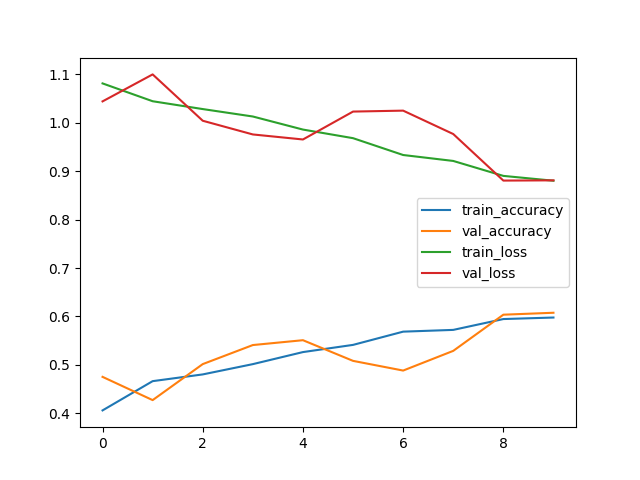
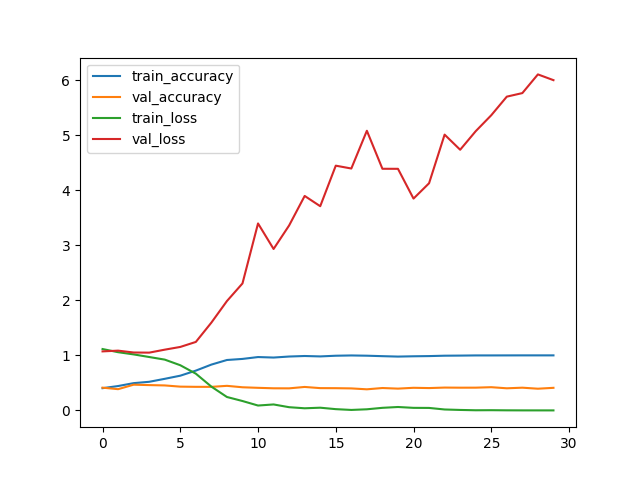
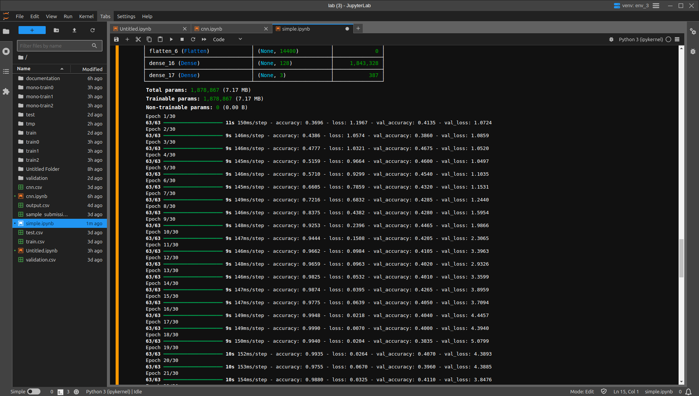
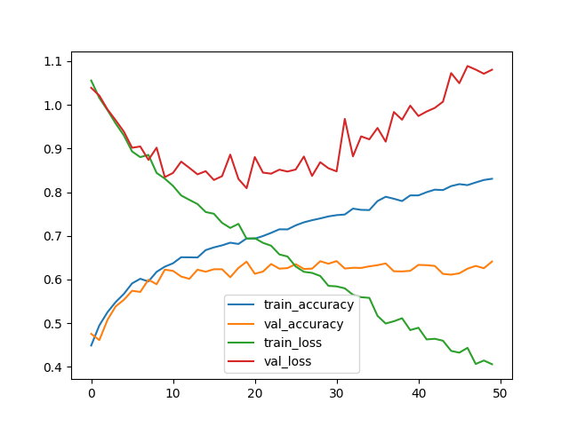
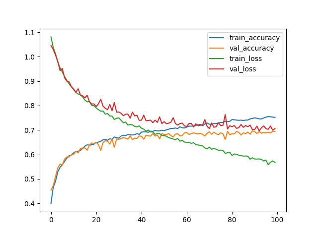
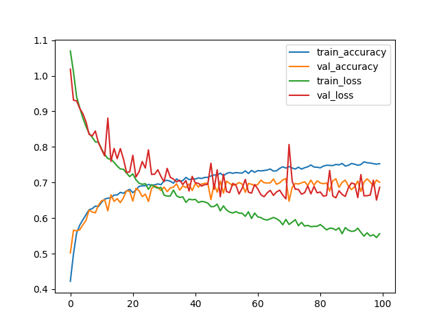

# Kaggle Images Classification Documentation

**Eduard-Valentin Dumitrescul (232)**

**May-June 2024**


## First Model (29th of May)

Loaded all the images with the corresponding labels. 
Multinomila Naive Bayes model: 0.418 accuracy in 12 seconds

Standardized  images: 0.418 accuracy in 4 seconds

> SVM: 0.39 with 100 iter

> SVM: 0.539 accuracy pooled 4*4 pixel areas together, max iterations
```
%%time
from sklearn import svm
from sklearn.preprocessing import MinMaxScaler
import numpy as np
import skimage.measure

reduced_training_images = (skimage.measure.block_reduce(training_images, (1,4,4,1), np.max)).reshape((10500, 10*40*3))
print(np.shape(reduced_training_images))
reduced_validation_images = (skimage.measure.block_reduce(validation_images, (1,4,4, 1), np.max)).reshape((3000, 10*40*3))

clf = svm.SVC(decision_function_shape='ovr', verbose=True, max_iter=-1, kernel="rbf")
clf.fit(reduced_training_images, training_labels)
score = clf.score(reduced_validation_images, validation_labels)

print("score on test: " + str(score))
```

> score on test: 0.5396666666666666
CPU times: user 1min 7s, sys: 628 ms, total: 1min 8s
Wall time: 1min 8s

## Image Preprocessing (30th of May)
- standardized (approximate preview)


- grayscale 


- mono (keep only the strongest pixel (eg. [23, 140, 24] -> [0, 140, 0]))


> SVM, mono images, 4x4 max pooling -> 0.498 accuracy

> SVM, grayscale, 2x2 max pooing -> 0.505 accuracy
```
clf = svm.SVC(decision_function_shape='ovr', verbose=True, max_iter=-1, kernel="rbf", C=1)
```


### CNN 1.0 (0.59 accuracy)
The first try using a Convolutional Neural Network:

```
import tensorflow as tf
from tensorflow.keras.utils import to_categorical
from tensorflow.keras.models import Sequential
from tensorflow.keras.layers import Conv2D, MaxPooling2D, AveragePooling2D, Flatten, Dense, Dropout
from tensorflow.keras.preprocessing.image import ImageDataGenerator
import numpy as np

model_train_images = standard_training_images
model_train_labels = to_categorical(training_labels, num_classes=3)
model_validation_images = standard_validation_images
model_validation_labels = to_categorical(validation_labels, num_classes=3)

trainining_datagen = ImageDataGenerator(
)
trainining_datagen.fit(model_train_images)


my_model = Sequential([
    Conv2D(16, (3, 3), activation='relu', input_shape=(80, 80, 3)),
    MaxPooling2D(2, 2),
    Conv2D(32, (3, 3), activation='relu'),
    MaxPooling2D(2, 2),
    Conv2D(32, (3, 3), activation='relu'),
    MaxPooling2D(2, 2),
    Conv2D(32, (3, 3), activation='relu'),
    Flatten(),
    Dense(256, activation='relu'),
    Dense(3, activation='softmax')
])
my_model.compile(
    optimizer='adam',
    loss='categorical_crossentropy',
    metrics=['accuracy']
)
my_model.summary()

history = my_model.fit(
    trainining_datagen.flow(model_train_images, model_train_labels, batch_size=32),
    epochs=10,
    validation_data=(model_validation_images, model_validation_labels),
)

loss, accuracy = my_model.evaluate(model_validation_images, model_validation_labels)
print(f'Validation accuracy: {accuracy}')
```


```
# confusion matrix
[[0.55072464 0.31189948 0.22222222]
 [0.21014493 0.34552846 0.38888889]
 [0.23913043 0.34257206 0.38888889]]
 ```


 ### CNN 1.1 (0.607)
 ```
 import tensorflow as tf
from tensorflow.keras.utils import to_categorical
from tensorflow.keras.models import Sequential
from tensorflow.keras.layers import Conv2D, MaxPooling2D, AveragePooling2D, Flatten, Dense, Dropout
from tensorflow.keras.optimizers import Adam
from tensorflow.keras.preprocessing.image import ImageDataGenerator
import numpy as np

model_train_images = standard_training_images
model_train_labels = to_categorical(training_labels, num_classes=3)
model_validation_images = standard_validation_images
model_validation_labels = to_categorical(validation_labels, num_classes=3)

trainining_datagen = ImageDataGenerator(
    rotation_range=40,
    width_shift_range=0.2,
    height_shift_range=0.2,
    shear_range=0.2,
    zoom_range=0.2,
    horizontal_flip=True,
    fill_mode='reflect'
)
trainining_datagen.fit(model_train_images)

validation_datagen = ImageDataGenerator(
    rotation_range=40,
    width_shift_range=0.2,
    height_shift_range=0.2,
    shear_range=0.2,
    zoom_range=0.2,
    horizontal_flip=True,
    fill_mode='reflect'
)
validation_datagen.fit(model_validation_images)

model_checkpoint_callback = tf.keras.callbacks.ModelCheckpoint(
    filepath="/tmp/checkpoint.keras",
    monitor='val_accuracy',
    mode='max',
    save_best_only=True)

# my_model = Sequential([
#     Conv2D(128, (3, 3), activation='relu', input_shape=(80, 80, 3)),
#     MaxPooling2D(2, 2),
#     Conv2D(128, (3, 3), activation='relu'),
#     MaxPooling2D(2, 2),
#     Conv2D(256, (3, 3), activation='relu'),
#     MaxPooling2D(2, 2),
#     Conv2D(256, (3, 3), activation='relu'),
#     Flatten(),
#     Dense(1024, activation='relu'),
#     Dense(3, activation='softmax')
# ])

my_model = Sequential([
    Conv2D(32, (3, 3), activation='relu', input_shape=(80, 80, 3)),
    Conv2D(32, (3, 3), activation='relu'),
    MaxPooling2D(2, 2),
    Conv2D(64, (3, 3), activation='relu'),
    Conv2D(64, (3, 3), activation='relu'),
    MaxPooling2D(2, 2),
    Conv2D(64, (3, 3), activation='relu'),
    Conv2D(128, (3, 3), activation='relu'),
    MaxPooling2D(2, 2),
    Conv2D(128, (3, 3), activation='relu'),
    Flatten(),
    Dense(256, activation='relu'),
    Dense(3, activation='softmax')
])
my_model.compile(
    optimizer=Adam(learning_rate=0.001),
    loss='categorical_crossentropy',
    metrics=['accuracy']
)
my_model.summary()

history = my_model.fit(
    trainining_datagen.flow(model_train_images, model_train_labels, batch_size=32),
    epochs=10,
    validation_data=(model_validation_images, model_validation_labels),
    callbacks=[model_checkpoint_callback],
)

loss, accuracy = my_model.evaluate(model_validation_images, model_validation_labels)
print(f'Validation accuracy: {accuracy}')
```



### CNN 1.3 (0.4 acc but 0.99 train)
The goal was to find a model the hugely overfits
- only used 2000 train images
- did not further modify the standardized images
```
my_model = Sequential([
    Conv2D(16, (3, 3), activation='relu', input_shape=(80, 80, 3)),
    Conv2D(16, (3, 3), activation='relu'),
    MaxPooling2D(2, 2),
    Conv2D(32, (3, 3), activation='relu'),
    Conv2D(32, (3, 3), activation='relu'),
    MaxPooling2D(2, 2),
    Conv2D(64, (3, 3), activation='relu'),
    Flatten(),
    Dense(128, activation='relu'),
    Dense(3, activation='softmax')
])
my_model.compile(
    optimizer=Adam(learning_rate=0.001),
    loss='categorical_crossentropy',
    metrics=['accuracy']
)
my_model.summary()

history = my_model.fit(
    trainining_datagen.flow(model_train_images, model_train_labels, batch_size=32),
    epochs=30,
    validation_data=validation_datagen.flow(model_validation_images, model_validation_labels),
    callbacks=[model_checkpoint_callback],
)
```




### CNN 2.0 (0.63 acc then overfits)
- used standardized images with no other preprocessing
- ran on kaggle notebook, which is faster
```
my_model = Sequential([
    Conv2D(32, (5, 5), strides=(3, 3), activation='relu', input_shape=(80, 80, 3)),
    MaxPooling2D(2, 2),
    Conv2D(64, (3, 3), activation='relu', padding='same'),
    Conv2D(128, (3, 3), activation='relu'),
    Conv2D(128, (3, 3), activation='relu'),
    Flatten(),
#         Dense(256, activation='relu'),
#     Dropout(0.5),
    Dense(256, activation='relu'),
    Dropout(0.5),
    Dense(256, activation='relu'),
    Dropout(0.5),
    Dense(3, activation='softmax')
])
my_model.compile(
    optimizer=Adam(learning_rate=0.0001),
    loss='categorical_crossentropy',
    metrics=['accuracy']
)
```


### CNN 2.1 (0.648 accu submitted)
 - switched to tensorflow.data.Dataset as they are musch faster
 - cropped the images to 72x72
 - tried to reduce the model complexity 



```
import tensorflow as tf
from tensorflow.data import Dataset

model_train_images = standard_training_images
model_train_labels = to_categorical(training_labels, num_classes=3)
model_validation_images = standard_validation_images
model_validation_labels = to_categorical(validation_labels, num_classes=3)

train_ds = tf.data.Dataset.from_tensor_slices((model_train_images, model_train_labels))
val_ds = tf.data.Dataset.from_tensor_slices((model_validation_images, model_validation_labels))
test_ds = tf.data.Dataset.from_tensor_slices(standard_test_images)

def augment(image, label):
#     image = tf.image.random_contrast(image, lower=0.8, upper=1.2)
#     image = tf.image.random_saturation(image, lower=0.8, upper=1.2)
#     image = tf.image.random_hue(image, max_delta=0.02)
#     image = tf.image.random_brightness(image, max_delta=0.2)
    image = tf.image.random_flip_left_right(image) # Padding to maintain size after augmentation
    image = tf.image.random_crop(image, size=[72, 72, 3])
    return image, label

def crop_center(image, label):
    image = tf.image.crop_to_bounding_box(image, 4, 4, 72, 72)
    return image, label

train_ds = train_ds.map(augment, num_parallel_calls=tf.data.AUTOTUNE)
train_ds = train_ds.shuffle(buffer_size=1000).batch(64).prefetch(tf.data.AUTOTUNE)
val_ds = val_ds.map(crop_center, num_parallel_calls=tf.data.AUTOTUNE)
val_ds = val_ds.batch(64).prefetch(tf.data.AUTOTUNE)
```

```
import tensorflow as tf
from tensorflow.data import Dataset
from tensorflow.keras.utils import to_categorical
from tensorflow.keras.models import Sequential
from tensorflow.keras.layers import Conv2D, MaxPooling2D, AveragePooling2D, Flatten, Dense, Dropout
from tensorflow.keras.optimizers import Adam
from tensorflow.keras.preprocessing.image import ImageDataGenerator
import numpy as np

model_checkpoint_callback = tf.keras.callbacks.ModelCheckpoint(
    filepath="/kaggle/working/tmp/checkpoint.keras",
    monitor='val_accuracy',
    mode='max',
    save_best_only=True)

my_model = Sequential([
    Conv2D(32, (5, 5), strides=(3, 3), activation='relu', input_shape=(72, 72, 3)),
    MaxPooling2D(2, 2),
    Conv2D(64, (3, 3), activation='relu', padding='same'),
#     Conv2D(128, (3, 3), activation='relu'),
    Conv2D(128, (3, 3), activation='relu'),
    Flatten(),
#     Dense(512, activation='relu'),
#     Dropout(0.5),
#     Dense(320, activation='relu'),
#     Dropout(0.5),
    Dense(128, activation='relu'),
    Dropout(0.5),
    Dense(3, activation='softmax')
])
my_model.compile(
    optimizer=Adam(learning_rate=0.0005),
    loss='categorical_crossentropy',
    metrics=['accuracy']
)
my_model.summary()

history = my_model.fit(
    train_ds,
    epochs=50,
    validation_data=val_ds,
    callbacks=[model_checkpoint_callback],
)

loss, accuracy = my_model.evaluate(val_ds)
print(f'Validation accuracy: {accuracy}')
```

### CNN 2.2 (0.69 accuracy)
```
my_model = Sequential([
    Conv2D(32, (3, 3), activation='relu', input_shape=(72, 72, 3)),
    MaxPooling2D(2, 2),
    Conv2D(64, (3, 3), activation='relu', padding='same'),
#     Conv2D(128, (3, 3), activation='relu'),
    Conv2D(128, (3, 3), activation='relu'),
    Flatten(),
#     Dense(512, activation='relu'),
#     Dropout(0.5),
#     Dense(320, activation='relu'),
#     Dropout(0.5),
    Dense(128, activation='relu'),
    Dropout(0.5),
    Dense(3, activation='softmax')
])
my_model.compile(
    optimizer=Adam(learning_rate=0.001),
    loss='categorical_crossentropy',
    metrics=['accuracy']
)
my_model.summary()

history = my_model.fit(
    train_ds,
    epochs=50,
    validation_data=val_ds,
    callbacks=[model_checkpoint_callback],
)
```


### CNN 2.3 (0.696 submitted)
- implemented a prediction method based on various croppings of the test images and sum the predictions, then select the maximum

```
model_checkpoint_callback = tf.keras.callbacks.ModelCheckpoint(
    filepath="/kaggle/working/tmp/checkpoint.keras",
    monitor='val_accuracy',
    mode='max',
    save_best_only=True)

my_model = Sequential([
    Conv2D(16, (3, 3), activation='relu', input_shape=(72, 72, 3)),
    MaxPooling2D(2, 2),  
    Conv2D(32, (3, 3), activation='relu'),
    MaxPooling2D(3, 3),
    Dropout(0.25),
    Conv2D(64, (3, 3), activation='relu'),
    Flatten(),
    Dense(128, activation='relu'),
    Dropout(0.5),
    Dense(3, activation='softmax')
])
my_model.compile(
    optimizer=Adam(learning_rate=0.0001),
    loss='categorical_crossentropy',
    metrics=['accuracy']
)
my_model.summary()

history = my_model.fit(
    train_ds,
    epochs=100,
    validation_data=val_ds,
    callbacks=[model_checkpoint_callback],
)
```



###  CNN 710
```
my_model = Sequential([
    Conv2D(32, (3, 3), activation='relu', input_shape=(72, 72, 3)),
    MaxPooling2D(2, 2),
    Conv2D(64, (3, 3), activation='relu'),
    MaxPooling2D(2, 2),
    Conv2D(128, (3, 3), activation='relu'),
    MaxPooling2D(2, 2),
    Flatten(),
    Dropout(0.5),
    Dense(256, activation='relu'),
    Dropout(0.5),
    Dense(256, activation='relu'),
    Dense(3, activation='softmax')
])
```


### CNN 747 (0.76 submitted)
```
my_model = Sequential([
    Conv2D(32, (3, 3), activation='relu', input_shape=(72, 72, 3)),
    Conv2D(32, (3, 3), activation='relu', padding="same"),
    MaxPooling2D(2, 2),
    Conv2D(64, (3, 3), activation='relu', padding="same"),
    Conv2D(64, (3, 3), activation='relu', padding="same"),
    MaxPooling2D(2, 2),
    Conv2D(128, (3, 3), activation='relu', padding='same'),
    MaxPooling2D(2, 2),
    Conv2D(256, (3, 3), activation='relu', padding='same'),    
    Flatten(),
    Dropout(0.5),
    Dense(512, activation='relu'),
    Dropout(0.5),
    Dense(1024, activation='relu'),
    Dense(3, activation='softmax')
])
my_model.compile(
    optimizer=Adam(learning_rate=0.001),
    loss='categorical_crossentropy',
    metrics=['accuracy']
)
my_model.summary()

history = my_model.fit(
    train_ds,
    epochs=100,
    validation_data=val_ds,
    callbacks=[model_checkpoint_callback],
)
```

### CNN 757 (0.768 submitted)
```
my_model = Sequential([
    Conv2D(32, (3, 3), activation='relu', input_shape=(72, 72, 3)),
    Conv2D(32, (3, 3), activation='relu', padding="same"),
    MaxPooling2D(2, 2),
    Conv2D(64, (3, 3), activation='relu', padding="same"),
    Conv2D(64, (3, 3), activation='relu', padding="same"),
    MaxPooling2D(2, 2),
    Conv2D(128, (3, 3), activation='relu', padding='same'),
    MaxPooling2D(2, 2),
    Conv2D(256, (3, 3), activation='relu', padding='same'),    
    Flatten(),
    Dropout(0.5),
    Dense(400, activation='relu'),
    Dropout(0.5),
    Dense(800, activation='relu'),
    Dense(3, activation='softmax')
])
my_model.compile(
    optimizer=Adam(learning_rate=0.001),
    loss='categorical_crossentropy',
    metrics=['accuracy']
)
my_model.summary()

history = my_model.fit(
    train_ds,
    epochs=300,
    validation_data=val_ds,
    callbacks=[model_checkpoint_callback],
)

```