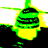
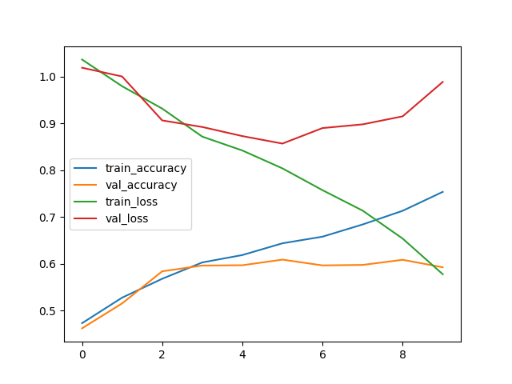
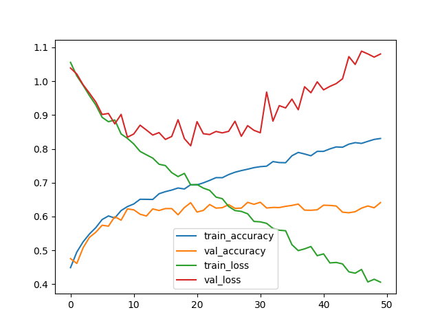
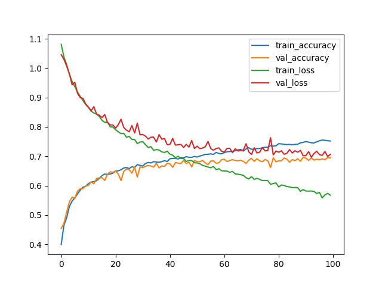
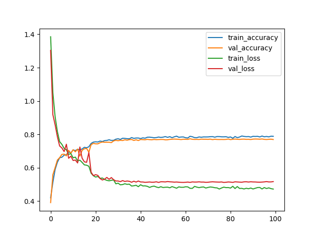

# Kaggle Images Classification Documentation

**Eduard-Valentin Dumitrescul (232)**

**May-June 2024**

## 1. Overview
For this image classification task I have tried two approaches:
- support vector machine (SVM) with 0.539 best validation score
- convolutional neural network (CNN) with 0.784 best score on validation dataset, 0.787 on reduced test dataset and 0.790 on full dataset

## 2. Dataset Loading
The images have been loaded using numpy, pandas and PIL.

The only modification was made on grayscale images, which had a single color channel, to convert to 3 color channels by copying the pixel values two times:
```
for i in range(len(images)):
    if images[i].shape != (80, 80, 3):
        images[i] = np.stack((images[i], images[i], images[i]), axis=-1)
```


## 3. Image preprocessing
During the development of the models, I have been experimenting with different approaches to image preprocessing, in hope of discovering interesting features of the dataset and achieving better results.

### 3.1 Standardization
The most used image preprocessing technique, which proved itself very useful for this task.
```
standard_training_images = (training_images - np.mean(training_images, axis=(0, 1, 2))) / np.std(training_images, axis=(0, 1, 2))
standard_validation_images = (validation_images - np.mean(validation_images, axis=(0, 1, 2))) / np.std(validation_images, axis=(0, 1, 2))
standard_test_images = (test_images - np.mean(test_images, axis=(0, 1, 2))) / np.std(test_images, axis=(0, 1, 2))
```


### 3.2 Grayscale
Another idea was to convert all the images to grayscale, in order to simplify the data and maybe help the models learn better.

This has negatively affected the score.

```
def to_grayscale(images):
    return np.mean(images, axis=(3))
```


### 3.3 Mono Pixel Color
To keep only the most proeminent colors of an image, I took each pixel and kept the color channel with the highest value.
```
def keep_strongest_color(rgb) :
    c = np.argmax(rgb)
    for i in range(3):
        if i != c:
            rgb[i] = 0
    return rgb

def process_images(images):
    for i in range(len(images)):
        for j in range(len(images[i])):
            for k in range(len(images[i][j])):
                images[i][j][k] = keep_strongest_color(images[i][j][k])
```


### 3.4 Cropping and Flipping
For the CNN, I experimented with different dataset augmentation techniques. These are the ones that increased model accuracy:
- cropping: from 80x80 to choosing a random 72x72 crop
- horizontal flipping
- vertical flipping
```
def augment(image, label):
    image = tf.image.random_flip_up_down(image)
    image = tf.image.random_flip_left_right(image)
    image = tf.image.random_crop(image, size=[72, 72, 3])
    return image, label
```
### 3.5 Other
I have also been experimenting with:
- brightness
- contrast
- shear
- zoom

which have negatively impacted the performance.

## 4. Models
### 4.1 SVM (0.539 prediction score)
The results achieved:
- 0.39 accuracy with 100 iterations
- 0.539 accuracy,  pooled 4*4 pixel areas together, max iterations
```
%%time
from sklearn import svm
from sklearn.preprocessing import MinMaxScaler
import numpy as np
import skimage.measure

reduced_training_images = (skimage.measure.block_reduce(training_images, (1,4,4,1), np.max)).reshape((10500, 10*40*3))
print(np.shape(reduced_training_images))
reduced_validation_images = (skimage.measure.block_reduce(validation_images, (1,4,4, 1), np.max)).reshape((3000, 10*40*3))

clf = svm.SVC(decision_function_shape='ovr', verbose=True, max_iter=-1, kernel="rbf")
clf.fit(reduced_training_images, training_labels)
score = clf.score(reduced_validation_images, validation_labels)

print("score on test: " + str(score))
```
```
score on test: 0.5396666666666666 CPU times: user 1min 7s, sys: 628 ms, total: 1min 8s Wall time: 1min 8s
```
- 0.498 accuracy with mono pixel color images and  4x4 max pooling 
- 0.505 accuracy with grayscale images and 2x2 max pooling

### 4.2 CNN 0.59
This was the first try with a CNN:
```
model_train_images = standard_training_images
model_train_labels = to_categorical(training_labels, num_classes=3)
model_validation_images = standard_validation_images
model_validation_labels = to_categorical(validation_labels, num_classes=3)

trainining_datagen = ImageDataGenerator()
trainining_datagen.fit(model_train_images)

my_model = Sequential([
    Conv2D(16, (3, 3), activation='relu', input_shape=(80, 80, 3)),
    MaxPooling2D(2, 2),
    Conv2D(32, (3, 3), activation='relu'),
    MaxPooling2D(2, 2),
    Conv2D(32, (3, 3), activation='relu'),
    MaxPooling2D(2, 2),
    Conv2D(32, (3, 3), activation='relu'),
    Flatten(),
    Dense(256, activation='relu'),
    Dense(3, activation='softmax')
])
my_model.compile(
    optimizer='adam',
    loss='categorical_crossentropy',
    metrics=['accuracy']
)
my_model.summary()

history = my_model.fit(
    trainining_datagen.flow(model_train_images, model_train_labels, batch_size=32),
    epochs=10,
    validation_data=(model_validation_images, model_validation_labels),
)

loss, accuracy = my_model.evaluate(model_validation_images, model_validation_labels)
print(f'Validation accuracy: {accuracy}')
```


```
# confusion matrix
[[0.55072464 0.31189948 0.22222222]
 [0.21014493 0.34552846 0.38888889]
 [0.23913043 0.34257206 0.38888889]]
 ```

 It is clear that the model overfits around 0.6. This is because there is no preprocessing done on the dataset besides standardization.

 The parameters used are the ones most used for this kind of task.

 ### 4.3 CNN 0.64
 For this model I have introduced:
 - image cropping (80x80 to 72x72)
 - callback that saves the model weights at the best validation score

 ```
 model_checkpoint_callback = tf.keras.callbacks.ModelCheckpoint(
    filepath="/kaggle/working/tmp/checkpoint.keras",
    monitor='val_accuracy',
    mode='max',
    save_best_only=True)

my_model = Sequential([
    Conv2D(32, (5, 5), strides=(3, 3), activation='relu', input_shape=(72, 72, 3)),
    MaxPooling2D(2, 2),
    Conv2D(64, (3, 3), activation='relu', padding='same'),
    Conv2D(128, (3, 3), activation='relu'),
    Flatten(),
    Dense(128, activation='relu'),
    Dropout(0.5),
    Dense(3, activation='softmax')
])
my_model.compile(
    optimizer=Adam(learning_rate=0.0005),
    loss='categorical_crossentropy',
    metrics=['accuracy']
)
my_model.summary()

history = my_model.fit(
    train_ds,
    epochs=50,
    validation_data=val_ds,
    callbacks=[model_checkpoint_callback],
)
```


### 4.4 CNN 0.69
Implemented a new technique for making better predictions based on averaging the predictions for different crops on the test images (corners, center and edges):
```
def predict_with_multiple_crops(model, images):
    prediction = model.predict(images[:,4:76,4:76,:])
    
    flipped_images = images[:,::-1,:,:]
    
    crops = [[0, 72], [4, 76], [8, 80]]
    
    for i1, i2 in crops:
        for j1, j2 in crops:
            cropped = images[:,i1:i2,j1:j2,:]
            print(np.shape(cropped))
            prediction += model.predict(cropped)
            
            cropped = flipped_images[:,i1:i2,j1:j2,:]
            print(np.shape(cropped))
            prediction += model.predict(cropped)
            
    prediction = np.argmax (prediction, axis = 1)
    return prediction
```

Also tried various model configurations and achieved the following:
```
my_model = Sequential([
    Conv2D(16, (3, 3), activation='relu', input_shape=(72, 72, 3)),
    MaxPooling2D(2, 2),  
    Conv2D(32, (3, 3), activation='relu'),
    MaxPooling2D(3, 3),
    Dropout(0.25),
    Conv2D(64, (3, 3), activation='relu'),
    Flatten(),
    Dense(128, activation='relu'),
    Dropout(0.5),
    Dense(3, activation='softmax')
])
my_model.compile(
    optimizer=Adam(learning_rate=0.0001),
    loss='categorical_crossentropy',
    metrics=['accuracy']
)
my_model.summary()

history = my_model.fit(
    train_ds,
    epochs=100,
    validation_data=val_ds,
    callbacks=[model_checkpoint_callback],
)
```


### 4.5 CNN 0.76
This is the model that achieved a 0.768 submitted prediction. It is clear that the previous models were too simple, so I added more, larger layers.

The downside is that, at this moment, training a model takes a lot of time.
```
my_model = Sequential([
    Conv2D(32, (3, 3), activation='relu', input_shape=(72, 72, 3)),
    Conv2D(32, (3, 3), activation='relu', padding="same"),
    MaxPooling2D(2, 2),
    Conv2D(64, (3, 3), activation='relu', padding="same"),
    Conv2D(64, (3, 3), activation='relu', padding="same"),
    MaxPooling2D(2, 2),
    Conv2D(128, (3, 3), activation='relu', padding='same'),
    MaxPooling2D(2, 2),
    Conv2D(256, (3, 3), activation='relu', padding='same'),    
    Flatten(),
    Dropout(0.5),
    Dense(400, activation='relu'),
    Dropout(0.5),
    Dense(800, activation='relu'),
    Dense(3, activation='softmax')
])
my_model.compile(
    optimizer=Adam(learning_rate=0.001),
    loss='categorical_crossentropy',
    metrics=['accuracy']
)
my_model.summary()

history = my_model.fit(
    train_ds,
    epochs=300,
    validation_data=val_ds,
    callbacks=[model_checkpoint_callback],
)
```
### 4.6 CNN 0.78 (0.79 on full test dataset)
This si my best model which obtained the best result after the end of the competition: 0.79051

The following changes were made:
- used more, but smaller convolutional layers
- only one smaller dense layer
- introduced batch normalization after each convolutional layer
- implemented a callback to reduce learning rate over time

```
model_checkpoint_callback = tf.keras.callbacks.ModelCheckpoint(
    filepath=f"/kaggle/working/tmp/{{val_accuracy:.3f}}.keras",
    monitor='val_accuracy',
    mode='max',
    save_best_only=True)

reduce_lr = tf.keras.callbacks.ReduceLROnPlateau(
    monitor='val_loss', 
    factor=0.2, 
    patience=5, 
    min_lr=0.00001
)

my_model = Sequential([
    Conv2D(32, (3, 3), activation='relu', input_shape=(72, 72, 3)),
    BatchNormalization(),
    Conv2D(32, (3, 3), activation='relu'),
    BatchNormalization(),
    Conv2D(32, (3, 3), activation='relu'),
    BatchNormalization(),
    Conv2D(32, (3, 3), activation='relu'),
    BatchNormalization(),
    MaxPooling2D(2, 2),
    Dropout(0.3),
    Conv2D(64, (3, 3), activation='relu'),
    BatchNormalization(),
    MaxPooling2D(2, 2),
    Conv2D(64, (3, 3), activation='relu'),
    BatchNormalization(),
    Dropout(0.3),
    Conv2D(128, (3, 3), activation='relu'),    
    BatchNormalization(),
    Dropout(0.2),
    Flatten(),
    Dense(256, activation='relu'),
    BatchNormalization(),
    Dropout(0.5),
    Dense(3, activation='softmax')
])
my_model.compile(
    optimizer=Adam(learning_rate=0.001),
    loss='categorical_crossentropy',
    metrics=['accuracy']
)

history = my_model.fit(
    train_ds,
    epochs=100,
    validation_data=val_ds,
    callbacks=[model_checkpoint_callback, reduce_lr],
)
```

*Confusion Matrix*
```
[[0.94611399 0.02153316 0.07093822]
 [0.01554404 0.67527993 0.22997712]
 [0.03834197 0.30318691 0.69908467]]
```



## Conclusion
After these attempts to build a good machine learning model for an image classification task, here are the ideas I find most important:
- image standardization may be the most important image preprocessing technique; apart from it, random cropping and flipping are great for data augmentation
- for this dataset and the models I've tried, adjusting contrast, brightness etc doesn't seem to benefit
- predicting based on multiple crops (and flips) of an image will probably improve the accuracy
- a model checkpoint callback is useful for saving the best model weigths, which sometimes are found before the model has finished training
- progressively reducing learning rate can delay overfitting and bring some benefits to the model
- more convolutional layers enable the model to learn more complex patterns